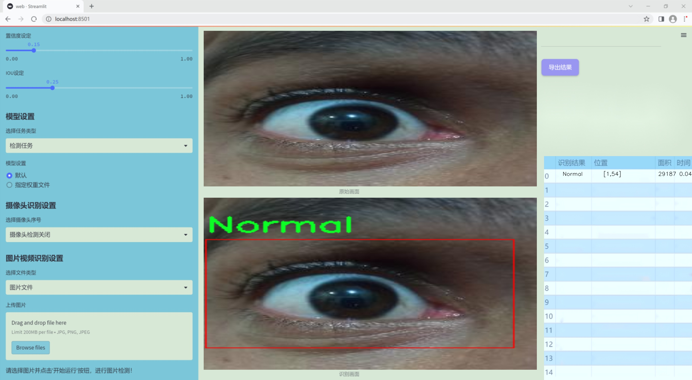
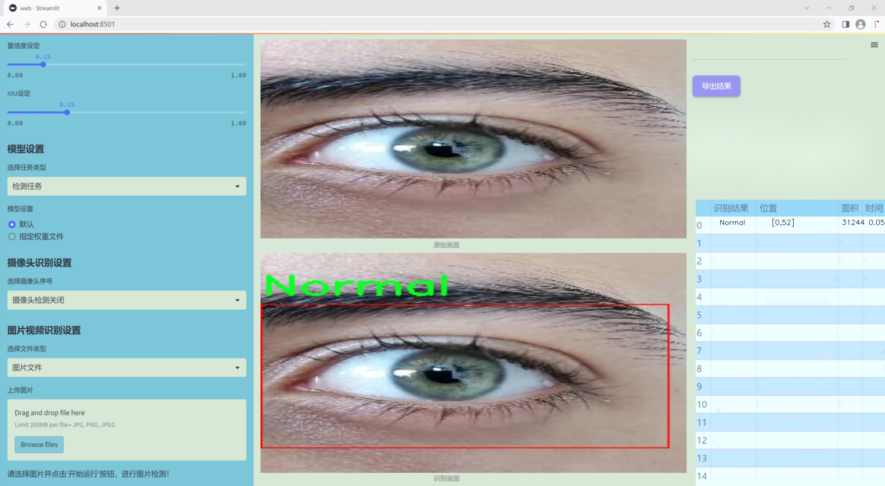
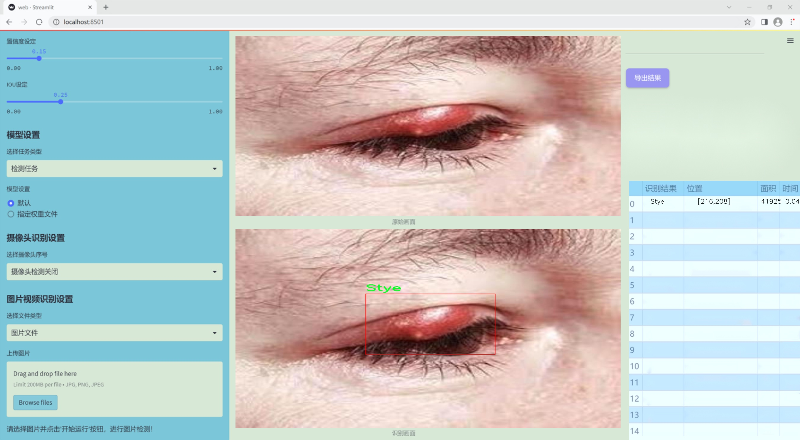
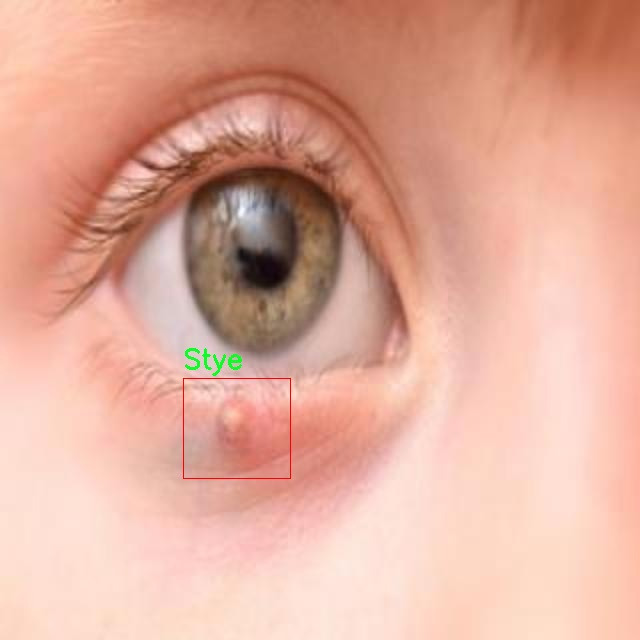
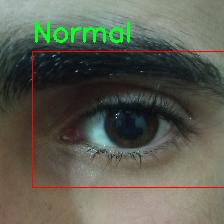
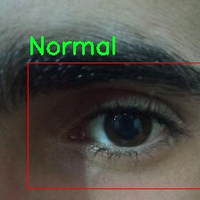
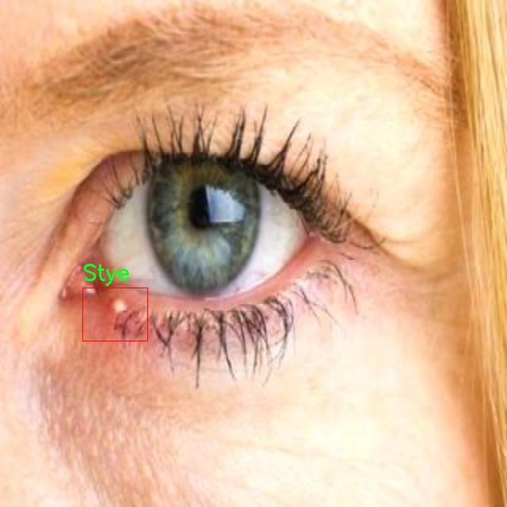
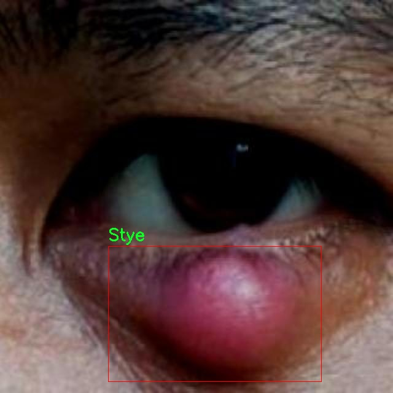

### 1.背景意义

研究背景与意义

随着全球人口老龄化的加剧，眼科疾病的发病率逐年上升，成为影响人们生活质量的重要健康问题。根据世界卫生组织的统计，眼科疾病不仅导致了大量的视觉障碍，还给患者及其家庭带来了沉重的经济负担。因此，早期检测和及时治疗眼科疾病显得尤为重要。传统的眼科疾病诊断主要依赖于医生的经验和专业知识，然而这种方法往往受到主观因素的影响，导致诊断结果的准确性和一致性存在差异。为了解决这一问题，基于计算机视觉的自动化检测系统应运而生，成为提高眼科疾病诊断效率和准确性的重要工具。

本研究旨在基于改进的YOLOv11模型，开发一套高效的眼科疾病检测系统。该系统将专注于四种主要眼科疾病的检测，包括白内障、正常眼、翼状胬肉和麦粒肿。通过利用包含792幅图像的数据集，系统将能够实现对这些疾病的快速识别和分类。YOLOv11作为一种先进的目标检测算法，具有实时性和高准确率的优势，能够有效地处理复杂的视觉信息，并在各种环境下保持稳定的性能。

此外，本研究的意义还在于推动计算机视觉技术在医疗领域的应用，尤其是在眼科疾病的早期筛查和诊断方面。通过自动化检测系统的开发，不仅可以减轻医生的工作负担，还能提高患者的就医体验。随着数据集的不断扩展和模型的持续优化，未来该系统有望实现更广泛的眼科疾病检测，助力于公共卫生的改善和眼科医疗资源的合理配置。因此，本研究不仅具有重要的学术价值，也将为眼科临床实践提供有力的技术支持。

### 2.视频效果

[2.1 视频效果](https://www.bilibili.com/video/BV1vdU6YqESQ/)

### 3.图片效果







##### [项目涉及的源码数据来源链接](https://kdocs.cn/l/cszuIiCKVNis)**

注意：本项目提供训练的数据集和训练教程,由于版本持续更新,暂不提供权重文件（best.pt）,请按照6.训练教程进行训练后实现上图演示的效果。

### 4.数据集信息

##### 4.1 本项目数据集类别数＆类别名

nc: 4
names: ['Catract', 'Normal', 'Pterygium', 'Stye']


该项目为【目标检测】数据集，请在【训练教程和Web端加载模型教程（第三步）】这一步的时候按照【目标检测】部分的教程来训练

##### 4.2 本项目数据集信息介绍

本项目数据集信息介绍

本项目旨在开发一个改进版的YOLOv11眼科疾病检测系统，为眼科疾病的早期诊断和治疗提供支持。为实现这一目标，我们构建了一个专门的数据集，聚焦于四种主要的眼科疾病。这些疾病包括白内障（Cataract）、正常眼睛（Normal）、翼状胬肉（Pterygium）和麦粒肿（Stye）。数据集的设计旨在涵盖不同年龄段、性别和种族的患者，以确保模型在多样化的临床场景中具有良好的泛化能力。

在数据集的构建过程中，我们严格筛选了高质量的眼部图像，确保每一类疾病的样本数量均衡且具有代表性。每一张图像都经过专业眼科医生的标注，确保数据的准确性和可靠性。此外，为了增强模型的鲁棒性，我们还对图像进行了多种数据增强处理，包括旋转、缩放、亮度调整等，以模拟不同的拍摄条件和患者状态。

数据集的类别数量为四个，分别代表了常见的眼科疾病和正常眼睛的状态。这种分类不仅有助于模型在检测时进行准确的判断，也为后续的临床应用提供了明确的参考依据。通过使用这一数据集，我们期望能够显著提高YOLOv11在眼科疾病检测中的性能，帮助医生更快速、准确地识别眼部疾病，从而提高患者的治疗效果和生活质量。整体而言，本项目的数据集不仅是技术开发的基础，也是推动眼科医疗智能化的重要一步。











### 5.全套项目环境部署视频教程（零基础手把手教学）

[5.1 所需软件PyCharm和Anaconda安装教程（第一步）](https://www.bilibili.com/video/BV1BoC1YCEKi/?spm_id_from=333.999.0.0&vd_source=bc9aec86d164b67a7004b996143742dc)


[5.2 安装Python虚拟环境创建和依赖库安装视频教程（第二步）](https://www.bilibili.com/video/BV1ZoC1YCEBw?spm_id_from=333.788.videopod.sections&vd_source=bc9aec86d164b67a7004b996143742dc)

### 6.改进YOLOv11训练教程和Web_UI前端加载模型教程（零基础手把手教学）

[6.1 改进YOLOv11训练教程和Web_UI前端加载模型教程（第三步）](https://www.bilibili.com/video/BV1BoC1YCEhR?spm_id_from=333.788.videopod.sections&vd_source=bc9aec86d164b67a7004b996143742dc)


按照上面的训练视频教程链接加载项目提供的数据集，运行train.py即可开始训练



     Epoch   gpu_mem       box       obj       cls    labels  img_size
     1/200     20.8G   0.01576   0.01955  0.007536        22      1280: 100%|██████████| 849/849 [14:42<00:00,  1.04s/it]
               Class     Images     Labels          P          R     mAP@.5 mAP@.5:.95: 100%|██████████| 213/213 [01:14<00:00,  2.87it/s]
                 all       3395      17314      0.994      0.957      0.0957      0.0843

     Epoch   gpu_mem       box       obj       cls    labels  img_size
     2/200     20.8G   0.01578   0.01923  0.007006        22      1280: 100%|██████████| 849/849 [14:44<00:00,  1.04s/it]
               Class     Images     Labels          P          R     mAP@.5 mAP@.5:.95: 100%|██████████| 213/213 [01:12<00:00,  2.95it/s]
                 all       3395      17314      0.996      0.956      0.0957      0.0845

     Epoch   gpu_mem       box       obj       cls    labels  img_size
     3/200     20.8G   0.01561    0.0191  0.006895        27      1280: 100%|██████████| 849/849 [10:56<00:00,  1.29it/s]
               Class     Images     Labels          P          R     mAP@.5 mAP@.5:.95: 100%|███████   | 187/213 [00:52<00:00,  4.04it/s]
                 all       3395      17314      0.996      0.957      0.0957      0.0845


###### [项目数据集下载链接](https://kdocs.cn/l/cszuIiCKVNis)

### 7.原始YOLOv11算法讲解

YOLOv11是Ultralytics推出的YOLO系列最新版本，专为实现尖端的物体检测而设计。其架构和训练方法上进行了重大改进，使之不仅具备卓越的准确性和处理速度，还在计算效率上实现了一场革命。得益于其改进的主干和颈部架构，YOLOv11在特征提取和处理复杂任务时表现更加出色。在2024年9月27日，Ultralytics通过长达九小时的在线直播发布这一新作，展示了其在计算机视觉领域的革新。

YOLOv11通过精细的架构设计和优化训练流程，在保持高精度的同时，缩减了参数量，与YOLOv8m相比减少了22%的参数，使其在COCO数据集上的平均准确度（mAP）有所提升。这种效率的提高使YOLOv11非常适合部署在各种硬件环境中，包括边缘设备、云计算平台以及支持NVIDIA GPU的系统，确保在灵活性上的优势。

该模型支持广泛的任务，从对象检测、实例分割到图像分类、姿态估计和定向对象检测（OBB），几乎覆盖了计算机视觉的所有主要挑战。其创新的C3k2和C2PSA模块提升了网络深度和注意力机制的应用，提高了特征提取的效率和效果。同时，YOLOv11的改进网络结构也使之在复杂视觉任务上得以从容应对，成为各类计算机视觉任务的多功能选择。这些特性令YOLOv11在实施实时物体检测的各个领域中表现出众。
* * *

2024年9月27日，Ultralytics在线直播长达九小时，为YOLO11召开“发布会”

YOLO11 是 Ultralytics YOLO 系列实时物体检测器的最新版本，它以尖端的准确性、速度和效率重新定义了可能性。在之前 YOLO
版本的显著进步的基础上，YOLO11 在架构和训练方法方面进行了重大改进，使其成为各种计算机视觉任务的多功能选择。


##### YOLO11主要特点：

  * 增强的特征提取：YOLO11 采用了改进的主干和颈部架构，增强了特征提取能力，可实现更精确的对象检测和复杂任务性能。
  * 针对效率和速度进行了优化：YOLO11 引入了完善的架构设计和优化的训练流程，可提供更快的处理速度，并在准确度和性能之间保持最佳平衡。
  * 更少的参数，更高的准确度：借助模型设计的进步，YOLO11m 在 COCO 数据集上实现了更高的平均准确度 (mAP)，同时使用的参数比 YOLOv8m 少 22%，从而提高了计算效率，同时又不影响准确度。
  * 跨环境的适应性：YOLO11 可以无缝部署在各种环境中，包括边缘设备、云平台和支持 NVIDIA GPU 的系统，从而确保最大的灵活性。
  * 支持的任务范围广泛：无论是对象检测、实例分割、图像分类、姿势估计还是定向对象检测 (OBB)，YOLO11 都旨在满足各种计算机视觉挑战。

##### 支持的任务和模式

YOLO11 以 YOLOv8 中引入的多功能模型系列为基础，为各种计算机视觉任务提供增强的支持：

Model| Filenames| Task| Inference| Validation| Training| Export  
---|---|---|---|---|---|---  
YOLO11| yolol11n.pt, yolol11s.pt, yolol11m.pt, yolol11x.pt| Detection| ✅| ✅|
✅| ✅  
YOLO11-seg| yolol11n-seg.pt, yolol11s-seg.pt, yolol11m-seg.pt,
yolol11x-seg.pt| Instance Segmentation| ✅| ✅| ✅| ✅  
YOLO11-pose| yolol11n-pose.pt, yolol11s-pose.pt, yolol11m-pose.pt,
yolol11x-pose.pt| Pose/Keypoints| ✅| ✅| ✅| ✅  
YOLO11-obb| yolol11n-obb.pt, yolol11s-obb.pt, yolol11m-obb.pt,
yolol11x-obb.pt| Oriented Detection| ✅| ✅| ✅| ✅  
YOLO11-cls| yolol11n-cls.pt, yolol11s-cls.pt, yolol11m-cls.pt,
yolol11x-cls.pt| Classification| ✅| ✅| ✅| ✅  
  
##### 简单的 YOLO11 训练和推理示例

以下示例适用于用于对象检测的 YOLO11 Detect 模型。

    
    
    from ultralytics import YOLO
    
    # Load a model
    model = YOLO("yolo11n.pt")
    
    # Train the model
    train_results = model.train(
        data="coco8.yaml",  # path to dataset YAML
        epochs=100,  # number of training epochs
        imgsz=640,  # training image size
        device="cpu",  # device to run on, i.e. device=0 or device=0,1,2,3 or device=cpu
    )
    
    # Evaluate model performance on the validation set
    metrics = model.val()
    
    # Perform object detection on an image
    results = model("path/to/image.jpg")
    results[0].show()
    
    # Export the model to ONNX format
    path = model.export(format="onnx")  # return path to exported model

##### 支持部署于边缘设备

YOLO11 专为适应各种环境而设计，包括边缘设备。其优化的架构和高效的处理能力使其适合部署在边缘设备、云平台和支持 NVIDIA GPU
的系统上。这种灵活性确保 YOLO11 可用于各种应用，从移动设备上的实时检测到云环境中的复杂分割任务。有关部署选项的更多详细信息，请参阅导出文档。

##### YOLOv11 yaml文件

    
    
    # Ultralytics YOLO 🚀, AGPL-3.0 license
    # YOLO11 object detection model with P3-P5 outputs. For Usage examples see https://docs.ultralytics.com/tasks/detect
    
    # Parameters
    nc: 80 # number of classes
    scales: # model compound scaling constants, i.e. 'model=yolo11n.yaml' will call yolo11.yaml with scale 'n'
      # [depth, width, max_channels]
      n: [0.50, 0.25, 1024] # summary: 319 layers, 2624080 parameters, 2624064 gradients, 6.6 GFLOPs
      s: [0.50, 0.50, 1024] # summary: 319 layers, 9458752 parameters, 9458736 gradients, 21.7 GFLOPs
      m: [0.50, 1.00, 512] # summary: 409 layers, 20114688 parameters, 20114672 gradients, 68.5 GFLOPs
      l: [1.00, 1.00, 512] # summary: 631 layers, 25372160 parameters, 25372144 gradients, 87.6 GFLOPs
      x: [1.00, 1.50, 512] # summary: 631 layers, 56966176 parameters, 56966160 gradients, 196.0 GFLOPs
    
    # YOLO11n backbone
    backbone:
      # [from, repeats, module, args]
      - [-1, 1, Conv, [64, 3, 2]] # 0-P1/2
      - [-1, 1, Conv, [128, 3, 2]] # 1-P2/4
      - [-1, 2, C3k2, [256, False, 0.25]]
      - [-1, 1, Conv, [256, 3, 2]] # 3-P3/8
      - [-1, 2, C3k2, [512, False, 0.25]]
      - [-1, 1, Conv, [512, 3, 2]] # 5-P4/16
      - [-1, 2, C3k2, [512, True]]
      - [-1, 1, Conv, [1024, 3, 2]] # 7-P5/32
      - [-1, 2, C3k2, [1024, True]]
      - [-1, 1, SPPF, [1024, 5]] # 9
      - [-1, 2, C2PSA, [1024]] # 10
    
    # YOLO11n head
    head:
      - [-1, 1, nn.Upsample, [None, 2, "nearest"]]
      - [[-1, 6], 1, Concat, [1]] # cat backbone P4
      - [-1, 2, C3k2, [512, False]] # 13
    
      - [-1, 1, nn.Upsample, [None, 2, "nearest"]]
      - [[-1, 4], 1, Concat, [1]] # cat backbone P3
      - [-1, 2, C3k2, [256, False]] # 16 (P3/8-small)
    
      - [-1, 1, Conv, [256, 3, 2]]
      - [[-1, 13], 1, Concat, [1]] # cat head P4
      - [-1, 2, C3k2, [512, False]] # 19 (P4/16-medium)
    
      - [-1, 1, Conv, [512, 3, 2]]
      - [[-1, 10], 1, Concat, [1]] # cat head P5
      - [-1, 2, C3k2, [1024, True]] # 22 (P5/32-large)
    
      - [[16, 19, 22], 1, Detect, [nc]] # Detect(P3, P4, P5)
    

**YOLO11和YOLOv8 yaml文件的区别**


##### 改进模块代码

  * C3k2 

    
    
    class C3k2(C2f):
        """Faster Implementation of CSP Bottleneck with 2 convolutions."""
    
        def __init__(self, c1, c2, n=1, c3k=False, e=0.5, g=1, shortcut=True):
            """Initializes the C3k2 module, a faster CSP Bottleneck with 2 convolutions and optional C3k blocks."""
            super().__init__(c1, c2, n, shortcut, g, e)
            self.m = nn.ModuleList(
                C3k(self.c, self.c, 2, shortcut, g) if c3k else Bottleneck(self.c, self.c, shortcut, g) for _ in range(n)
            )

C3k2，它是具有两个卷积的CSP（Partial Cross Stage）瓶颈架构的更快实现。

**类继承：**

  * `C3k2`继承自类`C2f`。这表明`C2f`很可能实现了经过修改的基本CSP结构，而`C3k2`进一步优化或修改了此结构。

**构造函数（`__init__`）：**

  * `c1`：输入通道。

  * `c2`：输出通道。

  * `n`：瓶颈层数（默认为1）。

  * `c3k`：一个布尔标志，确定是否使用`C3k`块或常规`Bottleneck`块。

  * `e`：扩展比率，控制隐藏层的宽度（默认为0.5）。

  * `g`：分组卷积的组归一化参数或组数（默认值为 1）。

  * `shortcut`：一个布尔值，用于确定是否在网络中包含快捷方式连接（默认值为 `True`）。

**初始化：**

  * `super().__init__(c1, c2, n, short-cut, g, e)` 调用父类 `C2f` 的构造函数，初始化标准 CSP 组件，如通道数、快捷方式、组等。

**模块列表（`self.m`）：**

  * `nn.ModuleList` 存储 `C3k` 或 `Bottleneck` 模块，具体取决于 `c3k` 的值。

  * 如果 `c3k` 为 `True`，它会初始化 `C3k` 模块。`C3k` 模块接收以下参数：

  * `self.c`：通道数（源自 `C2f`）。

  * `2`：这表示在 `C3k` 块内使用了两个卷积层。

  * `shortcut` 和 `g`：从 `C3k2` 构造函数传递。

  * 如果 `c3k` 为 `False`，则初始化标准 `Bottleneck` 模块。

`for _ in range(n)` 表示将创建 `n` 个这样的块。

**总结：**

  * `C3k2` 实现了 CSP 瓶颈架构，可以选择使用自定义 `C3k` 块（具有两个卷积）或标准 `Bottleneck` 块，具体取决于 `c3k` 标志。

  * C2PSA

    
    
    class C2PSA(nn.Module):
        """
        C2PSA module with attention mechanism for enhanced feature extraction and processing.
    
        This module implements a convolutional block with attention mechanisms to enhance feature extraction and processing
        capabilities. It includes a series of PSABlock modules for self-attention and feed-forward operations.
    
        Attributes:
            c (int): Number of hidden channels.
            cv1 (Conv): 1x1 convolution layer to reduce the number of input channels to 2*c.
            cv2 (Conv): 1x1 convolution layer to reduce the number of output channels to c.
            m (nn.Sequential): Sequential container of PSABlock modules for attention and feed-forward operations.
    
        Methods:
            forward: Performs a forward pass through the C2PSA module, applying attention and feed-forward operations.
    
        Notes:
            This module essentially is the same as PSA module, but refactored to allow stacking more PSABlock modules.
    
        Examples:
            >>> c2psa = C2PSA(c1=256, c2=256, n=3, e=0.5)
            >>> input_tensor = torch.randn(1, 256, 64, 64)
            >>> output_tensor = c2psa(input_tensor)
        """
    
        def __init__(self, c1, c2, n=1, e=0.5):
            """Initializes the C2PSA module with specified input/output channels, number of layers, and expansion ratio."""
            super().__init__()
            assert c1 == c2
            self.c = int(c1 * e)
            self.cv1 = Conv(c1, 2 * self.c, 1, 1)
            self.cv2 = Conv(2 * self.c, c1, 1)
    
            self.m = nn.Sequential(*(PSABlock(self.c, attn_ratio=0.5, num_heads=self.c // 64) for _ in range(n)))
    
        def forward(self, x):
            """Processes the input tensor 'x' through a series of PSA blocks and returns the transformed tensor."""
            a, b = self.cv1(x).split((self.c, self.c), dim=1)
            b = self.m(b)
            return self.cv2(torch.cat((a, b), 1))

`C2PSA` 模块是一个自定义神经网络层，带有注意力机制，用于增强特征提取和处理。

**类概述**

  * **目的：**

  * `C2PSA` 模块引入了一个卷积块，利用注意力机制来改进特征提取和处理。

  * 它使用一系列 `PSABlock` 模块，这些模块可能代表某种形式的位置自注意力 (PSA)，并且该架构旨在允许堆叠多个 `PSABlock` 层。

**构造函数（`__init__`）：**

  * **参数：**

  * `c1`：输入通道（必须等于 `c2`）。

  * `c2`：输出通道（必须等于 `c1`）。

  * `n`：要堆叠的 `PSABlock` 模块数量（默认值为 1）。

  * `e`：扩展比率，用于计算隐藏通道的数量（默认值为 0.5）。

  * **属性：**

  * `self.c`：隐藏通道数，计算为 `int(c1 * e)`。

  * `self.cv1`：一个 `1x1` 卷积，将输入通道数从 `c1` 减少到 `2 * self.c`。这为将输入分成两部分做好准备。

  * `self.cv2`：另一个 `1x1` 卷积，处理后将通道维度恢复回 `c1`。

  * `self.m`：一系列 `PSABlock` 模块。每个 `PSABlock` 接收 `self.c` 通道，注意头的数量为 `self.c // 64`。每个块应用注意和前馈操作。

**前向方法：**

  * **输入：**

  * `x`，输入张量。

  * **操作：**

  1. `self.cv1(x)` 应用 `1x1` 卷积，将输入通道大小从 `c1` 减小到 `2 * self.c`。

  2. 生成的张量沿通道维度分为两部分，`a` 和 `b`。

  * `a`：第一个 `self.c` 通道。

  * `b`：剩余的 `self.c` 通道。

  1. `b` 通过顺序容器 `self.m`，它是 `PSABlock` 模块的堆栈。这部分经过基于注意的处理。

  2. 处理后的张量 `b` 与 `a` 连接。

  3. `self.cv2` 应用 `1x1` 卷积，将通道大小恢复为 `c1`。

  * **输出：**

  * 应用注意和卷积操作后的变换后的张量。

**总结：**

  * **C2PSA** 是一个增强型卷积模块，它通过堆叠的 `PSABlock` 模块应用位置自注意力。它拆分输入张量，将注意力应用于其中一部分，然后重新组合并通过最终卷积对其进行处理。此结构有助于从输入数据中提取复杂特征。

##### 网络结构


### 8.200+种全套改进YOLOV11创新点原理讲解

#### 8.1 200+种全套改进YOLOV11创新点原理讲解大全

由于篇幅限制，每个创新点的具体原理讲解就不全部展开，具体见下列网址中的改进模块对应项目的技术原理博客网址【Blog】（创新点均为模块化搭建，原理适配YOLOv5~YOLOv11等各种版本）

[改进模块技术原理博客【Blog】网址链接](https://gitee.com/qunmasj/good)


#### 8.2 精选部分改进YOLOV11创新点原理讲解

###### 这里节选部分改进创新点展开原理讲解(完整的改进原理见上图和[改进模块技术原理博客链接](https://gitee.com/qunmasj/good)【如果此小节的图加载失败可以通过CSDN或者Github搜索该博客的标题访问原始博客，原始博客图片显示正常】

### Gold-YOLO


#### Preliminaries
YOLO系列的中间层结构采用了传统的FPN结构，其中包含多个分支用于多尺度特征融合。然而，它只充分融合来自相邻级别的特征，对于其他层次的信息只能间接地进行“递归”获取。

传统的FPN结构在信息传输过程中存在丢失大量信息的问题。这是因为层之间的信息交互仅限于中间层选择的信息，未被选择的信息在传输过程中被丢弃。这种情况导致某个Level的信息只能充分辅助相邻层，而对其他全局层的帮助较弱。因此，整体上信息融合的有效性可能受到限制。
为了避免在传输过程中丢失信息，本文采用了一种新颖的“聚集和分发”机制（GD），放弃了原始的递归方法。该机制使用一个统一的模块来收集和融合所有Level的信息，并将其分发到不同的Level。通过这种方式，作者不仅避免了传统FPN结构固有的信息丢失问题，还增强了中间层的部分信息融合能力，而且并没有显著增加延迟。


#### 低阶聚合和分发分支 Low-stage gather-and-distribute branch
从主干网络中选择输出的B2、B3、B4、B5特征进行融合，以获取保留小目标信息的高分辨率特征。


#### 高阶聚合和分发分支 High-stage gather-and-distribute branch
高级全局特征对齐模块（High-GD）将由低级全局特征对齐模块（Low-GD）生成的特征{P3, P4, P5}进行融合。


Transformer融合模块由多个堆叠的transformer组成，transformer块的数量为L。每个transformer块包括一个多头注意力块、一个前馈网络（FFN）和残差连接。采用与LeViT相同的设置来配置多头注意力块，使用16个通道作为键K和查询Q的头维度，32个通道作为值V的头维度。为了加速推理过程，将层归一化操作替换为批归一化，并将所有的GELU激活函数替换为ReLU。为了增强变换器块的局部连接，在两个1x1卷积层之间添加了一个深度卷积层。同时，将FFN的扩展因子设置为2，以在速度和计算成本之间取得平衡。


信息注入模块(Information injection module)： 高级全局特征对齐模块（High-GD）中的信息注入模块与低级全局特征对齐模块（Low-GD）中的相同。在高级阶段，局部特征（Flocal）等于Pi，因此公式如下所示：


#### 增强的跨层信息流动 Enhanced cross-layer information flow
为了进一步提升性能，从YOLOv6 中的PAFPN模块中得到启发，引入了Inject-LAF模块。该模块是注入模块的增强版，包括了一个轻量级相邻层融合（LAF）模块，该模块被添加到注入模块的输入位置。为了在速度和准确性之间取得平衡，设计了两个LAF模型：LAF低级模型和LAF高级模型，分别用于低级注入（合并相邻两层的特征）和高级注入（合并相邻一层的特征）。它们的结构如图5(b)所示。为了确保来自不同层级的特征图与目标大小对齐，在实现中的两个LAF模型仅使用了三个操作符：双线性插值（上采样过小的特征）、平均池化（下采样过大的特征）和1x1卷积（调整与目标通道不同的特征）。模型中的LAF模块与信息注入模块的结合有效地平衡了准确性和速度之间的关系。通过使用简化的操作，能够增加不同层级之间的信息流路径数量，从而提高性能而不显著增加延迟。


### 9.系统功能展示

图9.1.系统支持检测结果表格显示

  图9.2.系统支持置信度和IOU阈值手动调节

  图9.3.系统支持自定义加载权重文件best.pt(需要你通过步骤5中训练获得)

  图9.4.系统支持摄像头实时识别

  图9.5.系统支持图片识别

  图9.6.系统支持视频识别

  图9.7.系统支持识别结果文件自动保存

  图9.8.系统支持Excel导出检测结果数据


### 10. YOLOv11核心改进源码讲解

#### 10.1 repvit.py

以下是经过精简和注释的核心代码部分：

```python
import torch
import torch.nn as nn
from timm.models.layers import SqueezeExcite

def _make_divisible(v, divisor, min_value=None):
    """
    确保所有层的通道数是可被8整除的
    :param v: 输入的通道数
    :param divisor: 需要整除的数
    :param min_value: 最小值
    :return: 调整后的通道数
    """
    if min_value is None:
        min_value = divisor
    new_v = max(min_value, int(v + divisor / 2) // divisor * divisor)
    if new_v < 0.9 * v:  # 确保不低于原值的90%
        new_v += divisor
    return new_v

class Conv2d_BN(nn.Sequential):
    """
    包含卷积层和批归一化层的组合
    """
    def __init__(self, in_channels, out_channels, kernel_size=1, stride=1, padding=0, dilation=1, groups=1):
        super().__init__()
        # 添加卷积层
        self.add_module('conv', nn.Conv2d(in_channels, out_channels, kernel_size, stride, padding, dilation, groups, bias=False))
        # 添加批归一化层
        self.add_module('bn', nn.BatchNorm2d(out_channels))

    @torch.no_grad()
    def fuse_self(self):
        """
        融合卷积层和批归一化层为一个卷积层
        """
        conv, bn = self._modules.values()
        # 计算融合后的权重和偏置
        w = bn.weight / (bn.running_var + bn.eps)**0.5
        w = conv.weight * w[:, None, None, None]
        b = bn.bias - bn.running_mean * bn.weight / (bn.running_var + bn.eps)**0.5
        # 创建新的卷积层
        fused_conv = nn.Conv2d(w.size(1) * conv.groups, w.size(0), w.shape[2:], stride=conv.stride, padding=conv.padding, dilation=conv.dilation, groups=conv.groups)
        fused_conv.weight.data.copy_(w)
        fused_conv.bias.data.copy_(b)
        return fused_conv

class RepViTBlock(nn.Module):
    """
    RepViT模块，包含token混合和channel混合
    """
    def __init__(self, inp, hidden_dim, oup, kernel_size, stride, use_se, use_hs):
        super(RepViTBlock, self).__init__()
        self.identity = stride == 1 and inp == oup  # 判断是否为恒等映射
        if stride == 2:
            # 使用下采样
            self.token_mixer = nn.Sequential(
                Conv2d_BN(inp, inp, kernel_size, stride, (kernel_size - 1) // 2, groups=inp),
                SqueezeExcite(inp, 0.25) if use_se else nn.Identity(),
                Conv2d_BN(inp, oup, ks=1, stride=1, pad=0)
            )
            self.channel_mixer = nn.Sequential(
                Conv2d_BN(oup, 2 * oup, 1, 1, 0),
                nn.GELU() if use_hs else nn.Identity(),
                Conv2d_BN(2 * oup, oup, 1, 1, 0)
            )
        else:
            assert self.identity
            self.token_mixer = nn.Sequential(
                Conv2d_BN(inp, inp, 3, 1, 1, groups=inp),
                SqueezeExcite(inp, 0.25) if use_se else nn.Identity(),
            )
            self.channel_mixer = nn.Sequential(
                Conv2d_BN(inp, hidden_dim, 1, 1, 0),
                nn.GELU() if use_hs else nn.Identity(),
                Conv2d_BN(hidden_dim, oup, 1, 1, 0)
            )

    def forward(self, x):
        return self.channel_mixer(self.token_mixer(x))

class RepViT(nn.Module):
    """
    RepViT模型
    """
    def __init__(self, cfgs):
        super(RepViT, self).__init__()
        self.cfgs = cfgs  # 配置反向残差块
        layers = []
        input_channel = cfgs[0][2]  # 获取输入通道数
        # 构建第一个层
        patch_embed = nn.Sequential(Conv2d_BN(3, input_channel // 2, 3, 2, 1), nn.GELU(),
                                     Conv2d_BN(input_channel // 2, input_channel, 3, 2, 1))
        layers.append(patch_embed)
        # 构建反向残差块
        for k, t, c, use_se, use_hs, s in self.cfgs:
            output_channel = _make_divisible(c, 8)
            exp_size = _make_divisible(input_channel * t, 8)
            layers.append(RepViTBlock(input_channel, exp_size, output_channel, k, s, use_se, use_hs))
            input_channel = output_channel
        self.features = nn.ModuleList(layers)

    def forward(self, x):
        for f in self.features:
            x = f(x)
        return x

def repvit_m2_3(weights=''):
    """
    构建RepViT模型
    """
    cfgs = [
        # k, t, c, SE, HS, s 
        [3, 2, 80, 1, 0, 1],
        [3, 2, 80, 0, 0, 1],
        # 省略其他配置...
        [3, 2, 640, 0, 1, 2],
        [3, 2, 640, 1, 1, 1],
    ]
    model = RepViT(cfgs)
    if weights:
        model.load_state_dict(torch.load(weights)['model'])
    return model

if __name__ == '__main__':
    model = repvit_m2_3('repvit_m2_3_distill_450e.pth')
    inputs = torch.randn((1, 3, 640, 640))
    res = model(inputs)
    for i in res:
        print(i.size())
```

### 代码说明：
1. **_make_divisible**: 确保通道数是8的倍数，以便在硬件上优化性能。
2. **Conv2d_BN**: 组合卷积层和批归一化层，并提供融合方法以提高推理速度。
3. **RepViTBlock**: 实现RepViT的基本模块，包含token混合和channel混合。
4. **RepViT**: 构建整个RepViT模型，利用配置参数生成多个模块。
5. **repvit_m2_3**: 根据给定的配置构建RepViT模型，并可加载预训练权重。

通过这些核心部分的实现，RepViT模型能够有效地进行图像处理任务。

这个文件 `repvit.py` 是一个用于构建和训练 RepViT（Residual Vision Transformer）模型的 PyTorch 实现。该模型结合了卷积神经网络（CNN）和变换器（Transformer）的优点，适用于图像分类等任务。

首先，文件导入了必要的库，包括 PyTorch 的神经网络模块 `torch.nn`、NumPy 以及 `timm` 库中的 SqueezeExcite 层。接着，定义了一个名为 `replace_batchnorm` 的函数，该函数用于替换网络中的 BatchNorm2d 层为 Identity 层，主要用于模型推理时的优化。

`_make_divisible` 函数确保所有层的通道数都是 8 的倍数，以满足某些硬件加速的要求。接下来，定义了 `Conv2d_BN` 类，这是一个包含卷积层和 BatchNorm 层的组合，具有自我融合的能力，能够在推理时减少计算量。

`Residual` 类实现了残差连接的机制，允许在训练时使用随机丢弃，以增强模型的鲁棒性。它同样具有自我融合的功能，以便在推理时进行优化。

`RepVGGDW` 类实现了一种特殊的卷积结构，结合了深度可分离卷积和残差连接。该类的 `forward` 方法将输入通过卷积和 BatchNorm 层进行处理，并添加输入的残差。

`RepViTBlock` 类是模型的基本构建块，包含了通道混合和令牌混合的机制。它根据输入的步幅选择不同的结构，以适应不同的下采样需求。

`RepViT` 类是整个模型的主体，负责构建网络的各个层次。它根据配置参数 `cfgs` 来创建多个 `RepViTBlock`，并定义了前向传播的逻辑。该类还实现了 `switch_to_deploy` 方法，用于在推理时替换 BatchNorm 层。

`update_weight` 函数用于更新模型的权重，确保加载的权重与模型的结构相匹配。

接下来，定义了一系列的模型构造函数，如 `repvit_m0_9`、`repvit_m1_0` 等，这些函数根据不同的配置参数构建不同版本的 RepViT 模型，并可选择加载预训练权重。

最后，在文件的主程序部分，创建了一个 `repvit_m2_3` 模型实例，并生成随机输入进行测试，输出每个特征图的尺寸。

总体而言，这个文件实现了一个灵活且高效的视觉模型，结合了现代深度学习中的多种技术，适用于各种计算机视觉任务。

#### 10.2 SwinTransformer.py

以下是经过简化并添加详细中文注释的核心代码部分：

```python
import torch
import torch.nn as nn
import torch.nn.functional as F
import numpy as np

class Mlp(nn.Module):
    """ 多层感知机（MLP）模块。 """

    def __init__(self, in_features, hidden_features=None, out_features=None, act_layer=nn.GELU, drop=0.):
        super().__init__()
        out_features = out_features or in_features  # 输出特征数
        hidden_features = hidden_features or in_features  # 隐藏层特征数
        self.fc1 = nn.Linear(in_features, hidden_features)  # 第一层线性变换
        self.act = act_layer()  # 激活函数
        self.fc2 = nn.Linear(hidden_features, out_features)  # 第二层线性变换
        self.drop = nn.Dropout(drop)  # Dropout层

    def forward(self, x):
        """ 前向传播函数。 """
        x = self.fc1(x)  # 线性变换
        x = self.act(x)  # 激活
        x = self.drop(x)  # Dropout
        x = self.fc2(x)  # 线性变换
        x = self.drop(x)  # Dropout
        return x


class WindowAttention(nn.Module):
    """ 基于窗口的多头自注意力模块。 """

    def __init__(self, dim, window_size, num_heads, qkv_bias=True, attn_drop=0., proj_drop=0.):
        super().__init__()
        self.dim = dim  # 输入通道数
        self.window_size = window_size  # 窗口大小
        self.num_heads = num_heads  # 注意力头数
        head_dim = dim // num_heads  # 每个头的维度
        self.scale = head_dim ** -0.5  # 缩放因子

        # 相对位置偏置参数表
        self.relative_position_bias_table = nn.Parameter(
            torch.zeros((2 * window_size[0] - 1) * (2 * window_size[1] - 1), num_heads))

        # 计算相对位置索引
        coords_h = torch.arange(self.window_size[0])
        coords_w = torch.arange(self.window_size[1])
        coords = torch.stack(torch.meshgrid([coords_h, coords_w]))  # 生成坐标网格
        coords_flatten = torch.flatten(coords, 1)  # 展平坐标
        relative_coords = coords_flatten[:, :, None] - coords_flatten[:, None, :]  # 计算相对坐标
        relative_coords = relative_coords.permute(1, 2, 0).contiguous()  # 重新排列维度
        relative_coords[:, :, 0] += self.window_size[0] - 1  # 位置偏移
        relative_coords[:, :, 1] += self.window_size[1] - 1
        relative_coords[:, :, 0] *= 2 * self.window_size[1] - 1
        relative_position_index = relative_coords.sum(-1)  # 计算相对位置索引
        self.register_buffer("relative_position_index", relative_position_index)  # 注册为缓冲区

        self.qkv = nn.Linear(dim, dim * 3, bias=qkv_bias)  # 线性变换用于生成Q、K、V
        self.attn_drop = nn.Dropout(attn_drop)  # 注意力权重的Dropout
        self.proj = nn.Linear(dim, dim)  # 输出线性变换
        self.proj_drop = nn.Dropout(proj_drop)  # 输出的Dropout

    def forward(self, x, mask=None):
        """ 前向传播函数。 """
        B_, N, C = x.shape  # 获取输入形状
        qkv = self.qkv(x).reshape(B_, N, 3, self.num_heads, C // self.num_heads).permute(2, 0, 3, 1, 4)  # 计算Q、K、V
        q, k, v = qkv[0], qkv[1], qkv[2]  # 分离Q、K、V

        q = q * self.scale  # 缩放Q
        attn = (q @ k.transpose(-2, -1))  # 计算注意力分数

        # 添加相对位置偏置
        relative_position_bias = self.relative_position_bias_table[self.relative_position_index.view(-1)].view(
            self.window_size[0] * self.window_size[1], self.window_size[0] * self.window_size[1], -1)
        relative_position_bias = relative_position_bias.permute(2, 0, 1).contiguous()  # 重新排列维度
        attn = attn + relative_position_bias.unsqueeze(0)  # 加入偏置

        attn = F.softmax(attn, dim=-1)  # 计算softmax以获得注意力权重
        attn = self.attn_drop(attn)  # 应用Dropout

        x = (attn @ v).transpose(1, 2).reshape(B_, N, C)  # 计算加权和
        x = self.proj(x)  # 输出线性变换
        x = self.proj_drop(x)  # 应用Dropout
        return x


class SwinTransformer(nn.Module):
    """ Swin Transformer主干网络。 """

    def __init__(self, pretrain_img_size=224, patch_size=4, in_chans=3, embed_dim=96, depths=[2, 2, 6, 2],
                 num_heads=[3, 6, 12, 24], window_size=7, mlp_ratio=4., drop_rate=0., attn_drop_rate=0.):
        super().__init__()

        self.patch_embed = PatchEmbed(patch_size=patch_size, in_chans=in_chans, embed_dim=embed_dim)  # 图像分块嵌入
        self.layers = nn.ModuleList()  # 存储每一层

        # 构建每一层
        for i_layer in range(len(depths)):
            layer = BasicLayer(
                dim=int(embed_dim * 2 ** i_layer),
                depth=depths[i_layer],
                num_heads=num_heads[i_layer],
                window_size=window_size,
                mlp_ratio=mlp_ratio,
                drop=drop_rate,
                attn_drop=attn_drop_rate)
            self.layers.append(layer)

    def forward(self, x):
        """ 前向传播函数。 """
        x = self.patch_embed(x)  # 图像分块嵌入
        for layer in self.layers:
            x = layer(x)  # 逐层传递
        return x  # 返回最终输出


def SwinTransformer_Tiny(weights=''):
    """ 创建一个小型的Swin Transformer模型。 """
    model = SwinTransformer(depths=[2, 2, 6, 2], num_heads=[3, 6, 12, 24])  # 初始化模型
    if weights:
        model.load_state_dict(torch.load(weights)['model'])  # 加载权重
    return model
```

### 代码说明：
1. **Mlp类**：实现了一个简单的多层感知机，包含两个线性层和一个激活函数，支持Dropout。
2. **WindowAttention类**：实现了窗口注意力机制，支持相对位置偏置，计算Q、K、V并进行注意力计算。
3. **SwinTransformer类**：实现了Swin Transformer的主干结构，包含图像分块嵌入和多个Transformer层。
4. **SwinTransformer_Tiny函数**：创建一个小型的Swin Transformer模型，并可选择加载预训练权重。

这个程序文件实现了Swin Transformer模型，主要用于计算机视觉任务。Swin Transformer是一种层次化的视觉Transformer，采用了移动窗口机制以提高计算效率。以下是代码的主要组成部分和功能说明。

首先，程序导入了必要的库，包括PyTorch和一些用于构建神经网络的模块。接着定义了一个名为`Mlp`的类，它实现了一个多层感知机（MLP），包含两个线性层和一个激活函数（默认为GELU），以及可选的Dropout层。

接下来，定义了两个辅助函数`window_partition`和`window_reverse`，它们用于将输入特征图分割成窗口和将窗口合并回特征图。这是Swin Transformer中窗口注意力机制的基础。

`WindowAttention`类实现了基于窗口的多头自注意力机制（W-MSA），支持相对位置偏置。该类中定义了查询、键、值的线性变换，以及相对位置偏置的计算和应用。注意力权重通过Softmax函数进行归一化。

`SwinTransformerBlock`类是Swin Transformer的基本构建块，包含了规范化层、窗口注意力层和MLP层。它还实现了循环移位的功能，以支持SW-MSA（Shifted Window Multi-Head Self-Attention）。

`PatchMerging`类用于将特征图的补丁合并，以减少特征图的分辨率。它通过线性层将四个相邻的补丁合并为一个新的补丁。

`BasicLayer`类表示Swin Transformer中的一个基本层，包含多个Swin Transformer块，并在必要时执行下采样。

`PatchEmbed`类将输入图像划分为不重叠的补丁，并通过卷积层将这些补丁嵌入到高维空间中。

`SwinTransformer`类是整个模型的核心，负责构建模型的各个层次，并实现前向传播。它支持绝对位置嵌入、Dropout等功能，并在每个阶段后应用规范化层。

最后，定义了一个`update_weight`函数，用于加载预训练模型的权重，并定义了一个`SwinTransformer_Tiny`函数，用于创建一个小型的Swin Transformer模型实例。

总体来说，这个程序文件实现了Swin Transformer的各个组件，并提供了一个完整的模型结构，适用于图像分类、目标检测等计算机视觉任务。

#### 10.3 utils.py

以下是代码中最核心的部分，并附上详细的中文注释：

```python
import torch
import torch.nn.functional as F

def multi_scale_deformable_attn_pytorch(
    value: torch.Tensor,
    value_spatial_shapes: torch.Tensor,
    sampling_locations: torch.Tensor,
    attention_weights: torch.Tensor,
) -> torch.Tensor:
    """
    多尺度可变形注意力机制。

    参数:
        value: 输入特征图，形状为 (bs, C, num_heads, embed_dims)
        value_spatial_shapes: 特征图的空间形状，形状为 (num_levels, 2)
        sampling_locations: 采样位置，形状为 (bs, num_queries, num_heads, num_levels, num_points, 2)
        attention_weights: 注意力权重，形状为 (bs, num_heads, num_queries, num_levels, num_points)

    返回:
        output: 经过多尺度可变形注意力机制处理后的输出，形状为 (bs, num_queries, num_heads * embed_dims)
    """
    bs, _, num_heads, embed_dims = value.shape  # 获取输入特征图的批次大小、通道数、头数和嵌入维度
    _, num_queries, _, num_levels, num_points, _ = sampling_locations.shape  # 获取采样位置的相关维度

    # 将输入特征图按照空间形状分割成多个特征图
    value_list = value.split([H_ * W_ for H_, W_ in value_spatial_shapes], dim=1)
    
    # 将采样位置转换到[-1, 1]范围
    sampling_grids = 2 * sampling_locations - 1
    sampling_value_list = []  # 用于存储每个层级的采样值

    for level, (H_, W_) in enumerate(value_spatial_shapes):
        # 对于每个层级，进行特征图的处理
        value_l_ = value_list[level].flatten(2).transpose(1, 2).reshape(bs * num_heads, embed_dims, H_, W_)
        
        # 处理采样网格
        sampling_grid_l_ = sampling_grids[:, :, :, level].transpose(1, 2).flatten(0, 1)
        
        # 使用grid_sample进行双线性插值采样
        sampling_value_l_ = F.grid_sample(
            value_l_, sampling_grid_l_, mode="bilinear", padding_mode="zeros", align_corners=False
        )
        sampling_value_list.append(sampling_value_l_)  # 将采样值添加到列表中

    # 将注意力权重进行维度变换
    attention_weights = attention_weights.transpose(1, 2).reshape(
        bs * num_heads, 1, num_queries, num_levels * num_points
    )
    
    # 计算最终输出
    output = (
        (torch.stack(sampling_value_list, dim=-2).flatten(-2) * attention_weights)
        .sum(-1)
        .view(bs, num_heads * embed_dims, num_queries)
    )
    
    return output.transpose(1, 2).contiguous()  # 返回输出，调整维度顺序并确保内存连续
```

### 代码说明：
1. **输入参数**：
   - `value`：输入特征图，包含多个头的特征。
   - `value_spatial_shapes`：特征图的空间形状，用于分割特征图。
   - `sampling_locations`：指定的采样位置，包含多个查询和层级。
   - `attention_weights`：每个查询的注意力权重。

2. **处理流程**：
   - 将输入特征图根据空间形状分割成多个特征图。
   - 将采样位置转换到[-1, 1]范围，以适应`grid_sample`函数。
   - 对每个层级的特征图进行双线性插值采样，得到对应的采样值。
   - 通过注意力权重对采样值进行加权求和，最终得到输出。

3. **输出**：
   - 返回经过多尺度可变形注意力机制处理后的输出，形状为 `(bs, num_queries, num_heads * embed_dims)`。

这个程序文件 `utils.py` 是一个用于实现一些常用功能的模块，主要与深度学习和神经网络相关，特别是在使用 PyTorch 框架时。文件中包含了一些工具函数和多尺度可变形注意力机制的实现。

首先，文件导入了一些必要的库，包括 `copy`、`math`、`numpy` 和 `torch` 及其子模块。这些库提供了深度学习所需的基本功能和数学运算支持。

文件中定义了几个函数。`_get_clones(module, n)` 函数用于创建一个给定模块的克隆列表，返回一个 `nn.ModuleList`，其中包含 `n` 个深拷贝的模块。这在构建具有多个相同层的网络时非常有用。

`bias_init_with_prob(prior_prob=0.01)` 函数用于根据给定的概率值初始化卷积或全连接层的偏置值。它通过计算负对数几率来实现，返回一个浮点数作为偏置的初始化值。

`linear_init(module)` 函数用于初始化线性模块的权重和偏置。它使用均匀分布在一个特定的范围内初始化权重和偏置，范围是基于模块权重的形状计算得出的。

`inverse_sigmoid(x, eps=1e-5)` 函数计算张量的反 sigmoid 函数。它首先将输入限制在 [0, 1] 的范围内，然后通过对数运算计算反 sigmoid 值，避免了数值不稳定性。

最后，`multi_scale_deformable_attn_pytorch` 函数实现了多尺度可变形注意力机制。该函数接受四个参数：`value`、`value_spatial_shapes`、`sampling_locations` 和 `attention_weights`。它首先提取输入张量的形状信息，然后对每个尺度的特征图进行处理。通过对采样位置进行变换，使用 `F.grid_sample` 函数从特征图中采样，得到不同尺度的特征值。接着，函数将这些采样值与注意力权重结合，最终输出一个经过变形注意力机制处理的结果张量。

总体而言，这个文件提供了一些基础的工具函数和一个复杂的注意力机制实现，适用于深度学习模型的构建和训练，尤其是在目标检测和图像处理等任务中。

#### 10.4 UniRepLKNet.py

以下是经过简化并添加详细中文注释的核心代码部分：

```python
import torch
import torch.nn as nn
import torch.nn.functional as F

class GRNwithNHWC(nn.Module):
    """ 
    GRN (全局响应归一化) 层
    该层的输入假设为 (N, H, W, C) 格式
    """
    def __init__(self, dim, use_bias=True):
        super().__init__()
        self.use_bias = use_bias
        # 初始化可学习参数 gamma 和 beta
        self.gamma = nn.Parameter(torch.zeros(1, 1, 1, dim))
        if self.use_bias:
            self.beta = nn.Parameter(torch.zeros(1, 1, 1, dim))

    def forward(self, x):
        # 计算输入的 L2 范数
        Gx = torch.norm(x, p=2, dim=(1, 2), keepdim=True)
        # 计算归一化因子
        Nx = Gx / (Gx.mean(dim=-1, keepdim=True) + 1e-6)
        # 返回归一化后的输出
        if self.use_bias:
            return (self.gamma * Nx + 1) * x + self.beta
        else:
            return (self.gamma * Nx + 1) * x

class UniRepLKNetBlock(nn.Module):
    """
    UniRepLKNet 的基本模块
    """
    def __init__(self, dim, kernel_size, drop_path=0., deploy=False):
        super().__init__()
        # 卷积层
        self.dwconv = nn.Conv2d(dim, dim, kernel_size=kernel_size, stride=1, padding=kernel_size // 2, groups=dim)
        # 归一化层
        self.norm = nn.BatchNorm2d(dim)
        # Squeeze-and-Excitation (SE) 块
        self.se = SEBlock(dim, dim // 4)
        # 前馈网络
        self.pwconv1 = nn.Linear(dim, dim * 4)
        self.pwconv2 = nn.Linear(dim * 4, dim)

    def forward(self, inputs):
        # 前向传播
        x = self.dwconv(inputs)  # 卷积操作
        x = self.norm(x)         # 归一化
        x = self.se(x)           # SE 块
        x = F.gelu(x)            # 激活函数
        x = self.pwconv1(x)      # 前馈网络第一层
        x = self.pwconv2(x)      # 前馈网络第二层
        return x

class UniRepLKNet(nn.Module):
    """
    UniRepLKNet 模型
    """
    def __init__(self, in_chans=3, num_classes=1000, depths=(3, 3, 27, 3), dims=(96, 192, 384, 768)):
        super().__init__()
        self.stages = nn.ModuleList()
        # 构建各个阶段的模块
        for i in range(len(depths)):
            stage = nn.Sequential(
                *[UniRepLKNetBlock(dim=dims[i], kernel_size=3) for _ in range(depths[i])]
            )
            self.stages.append(stage)

    def forward(self, x):
        # 前向传播
        for stage in self.stages:
            x = stage(x)
        return x

# 示例用法
if __name__ == '__main__':
    inputs = torch.randn((1, 3, 640, 640))  # 随机输入
    model = UniRepLKNet()                   # 实例化模型
    res = model(inputs)                     # 前向传播
    print(res.shape)                        # 输出结果的形状
```

### 代码注释说明：
1. **GRNwithNHWC 类**：实现了全局响应归一化层，主要用于对输入特征进行归一化处理，提升模型的稳定性和性能。
2. **UniRepLKNetBlock 类**：构建了 UniRepLKNet 的基本模块，包含卷积层、归一化层、Squeeze-and-Excitation 块和前馈网络。
3. **UniRepLKNet 类**：构建了整个模型，包含多个 UniRepLKNetBlock 组成的阶段。
4. **示例用法**：展示了如何实例化模型并进行前向传播，输出结果的形状。

这个程序文件 `UniRepLKNet.py` 实现了一个名为 UniRepLKNet 的深度学习模型，主要用于音频、视频、点云、时间序列和图像识别等任务。该模型基于多个已有的模型架构，包括 RepLKNet、ConvNeXt、DINO 和 DeiT，旨在提供一种通用的感知能力。

程序开始部分引入了必要的库和模块，包括 PyTorch 和一些用于构建神经网络的功能模块。接下来，定义了一些基本的层和功能，包括 GRN（全局响应归一化）层、NCHW 和 NHWC 格式的转换层、以及用于卷积操作的函数 `get_conv2d`。该函数可以根据输入参数决定使用原生卷积还是高效的 iGEMM 大核卷积实现。

接下来，定义了 Squeeze-and-Excitation（SE）块，这是一个用于增强特征表示的模块。它通过自适应平均池化和两个卷积层来实现特征的压缩和激励。然后，程序中还实现了融合批归一化（Batch Normalization）和卷积层的函数，以优化模型的性能。

在模型的核心部分，定义了 `DilatedReparamBlock` 和 `UniRepLKNetBlock` 类，这些类构成了 UniRepLKNet 的基本构建块。`DilatedReparamBlock` 采用膨胀卷积来捕捉更大范围的上下文信息，而 `UniRepLKNetBlock` 则将多个模块组合在一起，包括卷积、归一化、激活和前馈网络。

接下来，`UniRepLKNet` 类是整个模型的主体，接受多个参数来配置模型的输入通道数、类别数、深度、特征维度等。它通过多层下采样和多个阶段的块构建整个网络，并在前向传播中根据设定的输出模式返回特征或分类结果。

最后，程序提供了一些函数，用于创建不同版本的 UniRepLKNet 模型，并加载预训练权重。程序的入口部分则演示了如何使用该模型进行推理，包括模型的部署模式切换。

总体而言，这个程序文件实现了一个灵活且高效的深度学习模型，适用于多种视觉和感知任务，并提供了多种配置选项以满足不同需求。

### 11.完整训练+Web前端界面+200+种全套创新点源码、数据集获取


# [下载链接：https://mbd.pub/o/bread/Z5eTl5lv](https://mbd.pub/o/bread/Z5eTl5lv)